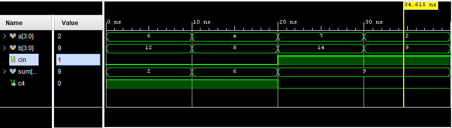
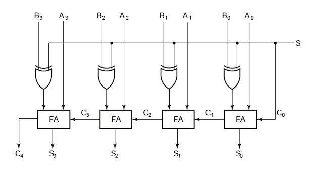
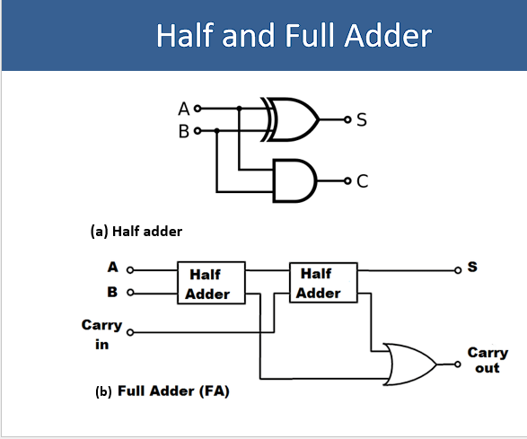
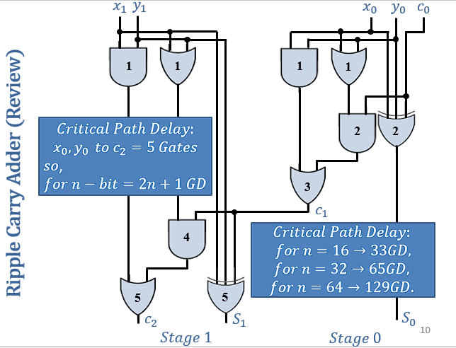

# 4-Bit Ripple Carry Adder/Subtractor in Verilog

This project implements a 4-bit Ripple Carry Adder (RCA) that performs both **addition** and **subtraction** using Verilog HDL. It includes:

- A full-adder module  
- A ripple-carry-based 4-bit adder/subtractor  
- A comprehensive testbench for simulation in Xilinx Vivado  

## 🧠 Functionality

The `rca` module performs either:

- **Addition** when control input `S = 0`  
- **Subtraction** when control input `S = 1`  

Subtraction is done using **2's complement logic**:  
`B' = B XOR 1`, `Cin = 1` → A - B = A + (~B + 1)

## 📁 File Structure

📂 RIPPLE_CARRY_ADDER/
├── rca.v # 4-bit Adder/Subtractor
├── full_adder.v # Basic 1-bit full adder
├── TB_rca.v # Testbench for simulation
├── Capture.png # Output waveform
├── README.md # Project documentation

nginx
Copy
Edit

## 📦 Modules

### `full_adder.v`

Implements a 1-bit full adder using basic gates:

```verilog
assign sum   = a ^ b ^ cin;
assign carry = (a & b) | (b & cin) | (cin & a);
rca.v
Chains 4 full adders and handles subtraction logic using XOR gates to invert B if S = 1.

TB_rca.v
Testbench that verifies the design for:

2 addition cases

2 subtraction cases

🔍 Simulation Output (Vivado XSIM)
yaml
Copy
Edit
Time    S   A      B      | SUM   C4
---------------------------------------
0 ns    0   0110   1100   | 0010   1   -> 6 + 12 = 18 (Carry out = 1)
10 ns   0   1110   1000   | 0110   1   -> 14 + 8 = 22
20 ns   1   0111   1110   | 1001   0   -> 7 - 14 = -7 (2's complement = 1001)
30 ns   1   0010   1001   | 1001   0   -> 2 - 9 = -7
✔️ All outputs match expected binary results.
```
📷 Waveform Example  


---

## 🧩 Visual Representations

### 🛠️ RTL Schematic (Vivado Synthesized)

This schematic shows how the `rca.v` and `full_adder.v` modules are interconnected during synthesis. Each full-adder block is chained, showing carry propagation from one stage to the next — a key feature of the ripple carry adder design.



---

### ⚙️ Half and Full Adder Logic

These diagrams illustrate the logic-level breakdown of:

- A **Half Adder** (HA): adds two bits, gives Sum and Carry
- A **Full Adder** (FA): builds upon HA and includes Carry-in

This logic is used to construct the full 4-bit RCA module.



---

### ⏱️ Critical Path & Delay Visualization

This diagram shows how the **carry signal ripples** through each stage. The *critical path delay* increases linearly with the number of bits:
- For `n = 4`, `t = 5C`
- For `n = 12`, `t = 33C`, etc.

This delay is a fundamental limitation of ripple-carry adders and motivates more advanced adder architectures in large designs.


